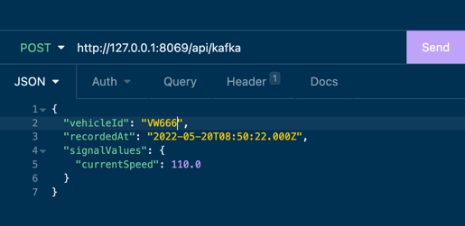
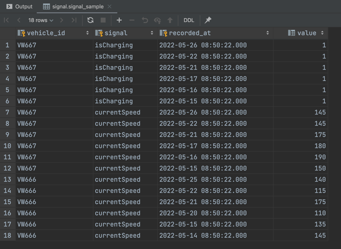
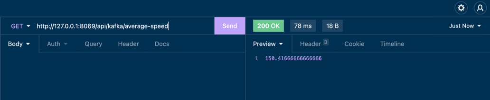
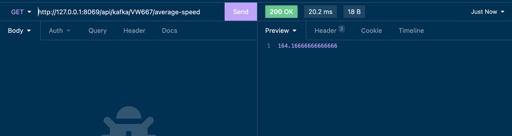
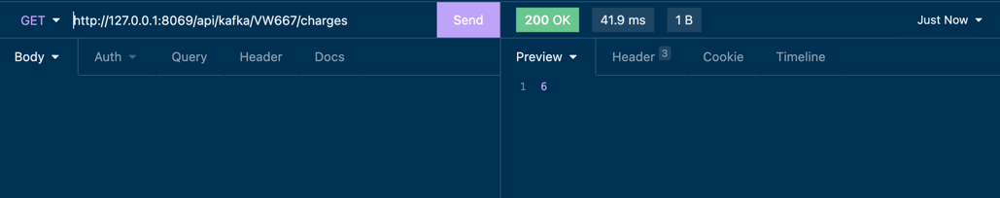

**App configuration and Usage**

**Configuration**

1. In the terminal window run: docker-compose up (this will start the kafka and cassandra docker containers)
2. Install the Python package needed for cassandra DB configuration: pip3 install cassandra-driver
3. Run: python3 setupCassandra.py (this will create the keyspace and the table in cassandra)

**App Usage**
1. Run the app.
2. In the Controller class there are different endpoints used for sending or getting data.
3. Use an API client (Insomnia, Postman) to send data to the Kafka topic and get data from the database.
The Controller is added just for easier interaction with the app and the data.

**Example**

Do a POST method to this endpoint http://127.0.0.1:8069/api/kafka with this json:
``{
"vehicleId": "VW667",
"recordedAt": "2022-05-20T08:50:22.000Z",
"signalValues": {
"currentSpeed": 110.0
}
}``

or

``{
"vehicleId": "VW667",
"recordedAt": "2022-05-15T08:50:22.000Z",
"signalValues": {
"isCharging": 1.0
}
}``

Note: Supported signalValues are: currentSpeed, odometer, uptime, isCharging.

This will publish the message to the kafka topic.

Do a couple of post methods with different times, signals and vehicleIds. Then we have enough data for get methods.

Cassandra DB after posts:

Get average speed:

Get average speed by ID (for a single vehicle):

Get number of charges by ID:

These are just a couple of examples, the rest of the endpoints available in the Controller.

**Interacting with the cassandra container**
1. Connect to the cassandra docker container through the terminal: `docker exec -it cassandra_kafka bash`
2. Run: `cqlsh`
3. Run: `use signal` (to use our keyspace)
4. Run the desired queries!

**Note:**
If an error about slf4j appears, just do: rm -rf.m2/repository/org/slf4j/slf4j-reload4j/1.7.36/slf4j-reload4j-1.7.36.jar